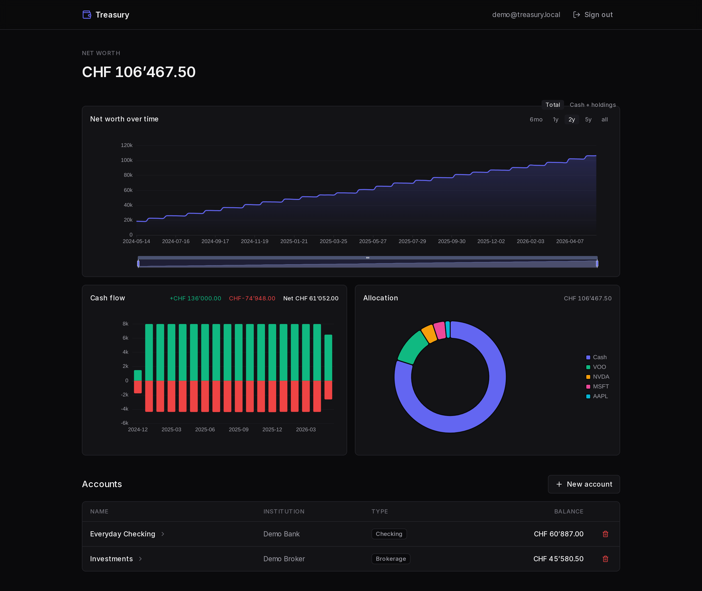

# Treasury

Personal net worth tracker. Imports broker and bank exports, fetches market prices from Yahoo, draws charts.

Open source, self-hostable, runs in Docker.



## What it does

Accounts hold transactions. Transactions can be entered by hand or imported. Holdings are derived from the transaction stream (sum of quantities per ISIN). Prices and FX rates come from Yahoo Finance, refreshed daily, with a backfill command for full history.

**Account types** include bank checking/savings, brokerage, crypto (exchange or wallet), precious metals (physical coins/bars priced from spot), Swiss Pillar 3a, real estate, vehicles, and "other".

**Pillar 3a** has its own flow: define an allocation strategy (% per ETF), then log contributions — the system auto-generates the buy legs based on the strategy effective at the contribution date.

**Coins and bars** are priced from the gold spot price × weight × premium, so you can track physical metal without entering daily quotes manually.

**Charts:** net worth over time (total or stacked cash + holdings), performance (return vs deposits AND time-weighted return), allocation donut, cash flow (monthly income vs expense), per-asset price history.

**Backup / restore:** one-click JSON export of accounts + transactions + allocations from the Settings page. Drop-in import the JSON back — single account or full backup, with skip / replace modes.

## Importers

- **ZKB** (Zürcher Kantonalbank) — CAMT.053 ISO 20022 XML statements
- **Degiro Trades** export (CSV)
- **Degiro Account Statement / Kontoauszug** (CSV — the richer one with dividends, fees, FX legs)
- **Interactive Brokers Statement of Funds** (Flex Query, CSV)

Drop a file on the **Import CSV** button in any account. The format is detected from the headers.

## Stack

PHP 8.4 / Symfony 7, Vue 3 + Vite + Pinia + Tailwind v4 + ECharts, MariaDB 10.6+ or MySQL 8+. All in Docker.

## Setup

You need Docker. Nothing else.

```
docker compose up -d --build
docker compose exec php php bin/console doctrine:migrations:migrate --no-interaction
docker compose exec php php bin/console app:user:create you@example.com yourpassword
```

Open <http://127.0.0.1:5173> and log in. To unlock the admin panel (registration codes, future settings), promote your user:

```
docker compose exec php php bin/console app:user:make-admin you@example.com
```

The first start takes a few minutes (image pulls, composer install, npm install). Subsequent starts are seconds.

Ports:

- `5173` — Vite (the URL you actually use)
- `8000` — Symfony backend
- `33306` — MySQL on the host (not `3306`, to leave that free for a system-installed MySQL)

## Multi-user (optional)

Sign-up is gated by single-use **registration codes** so the instance doesn't accept public accounts. As an admin:

1. Open **Settings → Registration codes** in the UI
2. Click **New code** (optionally label it "for Alice")
3. Send the code to the new user; they sign up at `/register`

Codes are one-shot — once used they can't be redeemed again. Unused codes can be revoked from the same panel.

## Common commands

```
docker compose exec php php bin/console app:user:create <email> <password>
docker compose exec php php bin/console app:user:change-password <email>     # interactive prompt
docker compose exec php php bin/console app:user:make-admin <email>
docker compose exec php php bin/console app:prices:refresh                   # latest prices for held assets
docker compose exec php php bin/console app:prices:backfill --range=max      # full history
docker compose exec php php bin/console doctrine:migrations:migrate
docker compose exec -e APP_ENV=test php php bin/phpunit                      # tests
docker compose exec database mysql -uroot -p'!ChangeMe!' app
docker compose logs -f php
```

The `APP_ENV=test` override on phpunit is needed because compose sets `APP_ENV=dev` on the php service.

A daily scheduler runs `app:prices:refresh` at 22:30 (see `src/Schedule.php`); no cron setup needed.

## Importing details

For IBKR, set up a Flex Query in Client Portal under Performance & Reports. One section: "Statement of Funds", CSV format. Include the standard fields — `TransactionID`, `Date`, `ActivityCode`, `Symbol`, `ISIN`, `Amount`, `CurrencyPrimary`, `TradeQuantity`, `LevelOfDetail`.

For ZKB, export the CAMT.053 XML statement from e-banking (Documents → Account statements).

Re-imports are idempotent. Duplicate rows are detected by content hash (or by `TransactionID` for IBKR) and skipped. Multi-fill orders with identical-looking rows are handled by an occurrence counter so each fill becomes its own transaction.

After each import the system fetches latest prices and FX for any new assets. For the full historical series, run `app:prices:backfill`.

## Quirks

Yahoo Finance is unofficial and can break. The provider sits behind `App\Price\PriceProvider`, so swapping to another source is a one-class change.

For London listings (`.L` tickers), Yahoo returns prices in pence. The provider rescales them to GBP.

If Yahoo has no price for an asset on a given historical date, that asset contributes 0 for that date instead of guessing. The line picks up as price coverage grows.

Coin/bar pricing uses the gold spot reference asset (ISIN `SPOT:GOLD`) × weight in grams ÷ troy ounce × (1 + premium %), so the whole valuation chain still flows through the regular price refresh.

All IDs are UUIDv7. Money is stored as bigint minor units throughout — no floats in the money path.

## Layout

```
src/
  Controller/Api/   JSON endpoints
  Entity/           Doctrine entities
  Import/           CSV/XML importers + ImportService
  Price/            Yahoo provider + PriceFetcher
  Holdings/         Derived positions (incl. coin/bar valuation)
  TimeSeries/       Net-worth, performance, cashflow computation
  Pillar3a/         Contribution → trade-leg generation
  Backup/           JSON export/import service
  Command/          Console commands (user mgmt, prices, seeding)
  Schedule.php      Symfony Scheduler config (daily price refresh)
frontend/
  src/components/   Charts, forms, modals, dropzone
  src/views/        Landing, login, register, dashboard, accounts, account, settings
  src/stores/       Pinia stores (auth, accounts, toasts)
docker/             Container definitions (dev + prod Dockerfiles)
samples/            (gitignored) your CSV exports
migrations/         Doctrine migrations
tests/              PHPUnit
```
